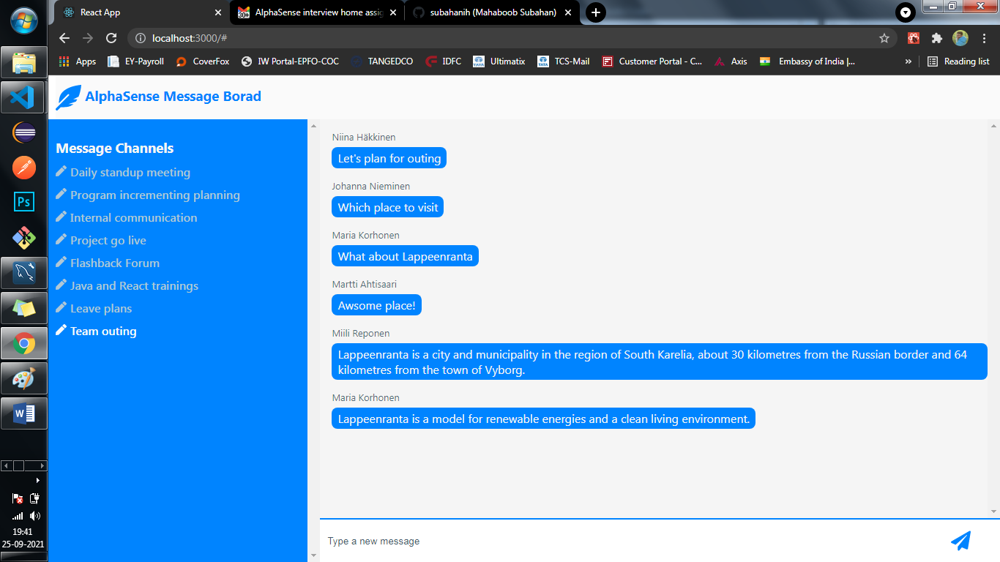

# message-board-frontend
Message Board Application

This application is developed for message chatting and comprises of multiple channels.
Users can select a channel from a list of channels, view messages in the selected
channel, and submit new messages to the selected channel.

This application comprises of two phases.
    1. message-board-frontend
    Front-end has been developed using ReactJS(react, react-dom, react-icons, react-scripts, web-vitals)

    Github Link: https://github.com/subahanih/message-board-frontend

    2. message-board-backend
    Back-end has been developed using ExpressJs(cors, dotenv, express, express-validator, mysql2)
    Backend exposes the below services to frontend inorder to fetch channels, messages related to channel, create messages and fetch the user.
        i. http://localhost:3001/api/v1/message/channelId/1
        ii. http://localhost:3001/api/v1/message/channel
        iii. http://localhost:3001/api/v1/message/create
        iv. http://localhost:3001/api/v1/message/user/userId/4 added one more endpoint, which is not specified in the specification. But it would required to fetch user information. As we are using cache beore message is going to/coming from API(back-end) it should display immediately. For this scenario I wanted to get user details. This I have done with Math.random. So evry new seession automatically it will be selecting a user.

    Github Link: https://github.com/subahanih/message-board-backend

### Note:
Application will use the front-end port while consuming API. For this I have enable proxy connection in the package.jason("proxy": "http://localhost:3001"). So fron-end will consume services as mentioned below.
    i. http://localhost:3000/api/v1/message/channelId/1
    ii. http://localhost:3000/api/v1/message/channel
    iii. http://localhost:3000/api/v1/message/create
    iv. http://localhost:3001/api/v1/message/userId/5

### What is missing?
    ■ Submit button is disabled if there is no text in message body (I have used react Icon and onClick function. icon would be enabled but it will not trigger the service.)

### What is completed?
    ● Client visuals
        ○ Render a full page application with three panels
        ○ Navigation panel shows a list of channels
        ○ Message list panel shows a list of message bodies for one channel
        ○ Editor panel shows a text area input
            ■ Editor panel is hidden if there is no channel selected
            ■ Editor has a submit button

    ● Interactions
        ○ Clicking a channel in navigation panel selects that channel
        ○ Entering text in editor and clicking submit adds message to the currently selected channel
        ○ Submitting editor clears input
        ○ Switching channels clears input

    ● State
        ○ Channel list
            ■ Channel list is loaded once on loading the application
        ○ Channel selection
            ■ Initially no channel is selected
        ○ Selected channel and messages
            ■ There is no upfront loading of messages
            ■ Messages already in local state are showed immediately
            ■ Messages are loaded from remote on channel selection and updated to screen
            ■ Messages are also stored to local state after loading the from remote
    
    ● Messages
        ○ Editing is not required, only creation
        ○ Upon submitting a message to a channel that message is available for other users
        ○ Submitting user sees message in message list after submitting
            ■ Render created message in the list immediately before refreshing from backend

    ● No error handling required

### How to run (Please go through README.md for configuring message-board-backend)?
    1. npm int
    2. npm install
    3. npm start (Default port is 3000)

### Frontend view from the browser. Before selecting a channel.
Before selecting a channel text box will be inactive and we will not be able to type anything.

### Frontend view from the browser. After selecting a channel.

